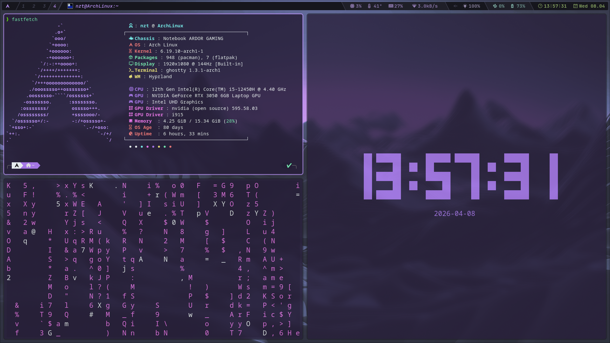

<h1 align="center"> &#128126; NZT Build &#128126; </h1>

<!-- INFORMATION -->
<h1 align="left">  &#127761; About</h1> 

 

 - OS: [**`Arch Linux`**](https://archlinux.org/)
 - WM: [**`Hyprland`**](https://hypr.land/)
 - Bar: [**`Waybar`**](https://waybar.org/)
 - Terminal: [**`Ghostty`**](https://ghostty.org/)
 - App Launcher: [**`Fuzzel`**](https://codeberg.org/dnkl/fuzzel)
 - Shell: [**`Zsh`**](https://github.com/ohmyzsh/ohmyzsh)

 
