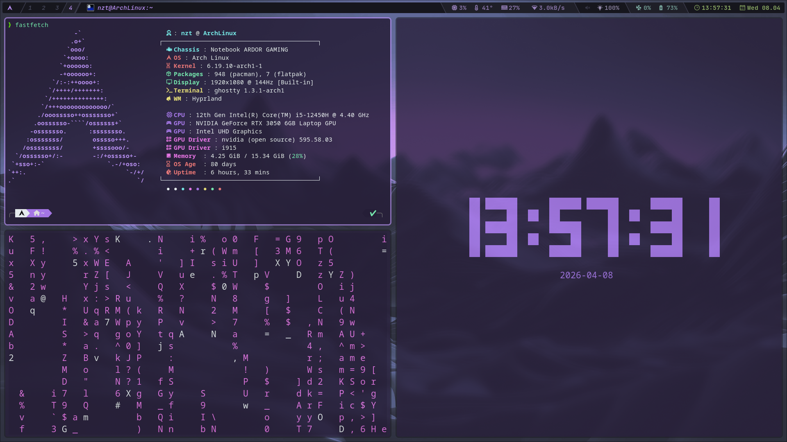
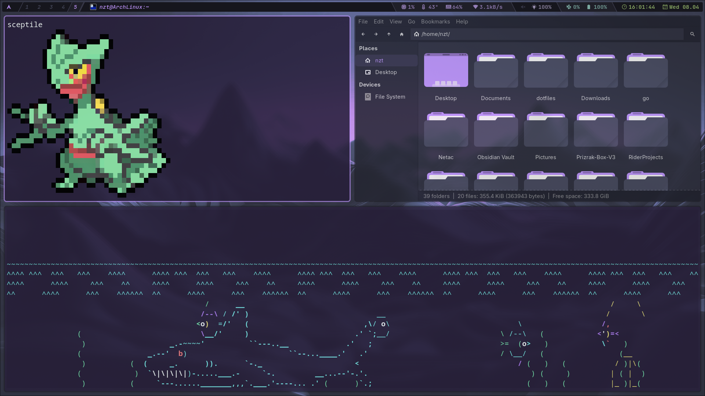
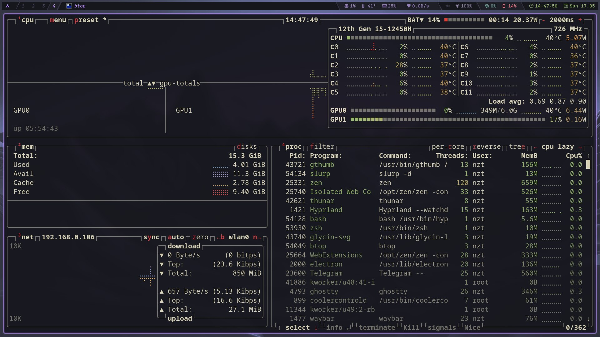
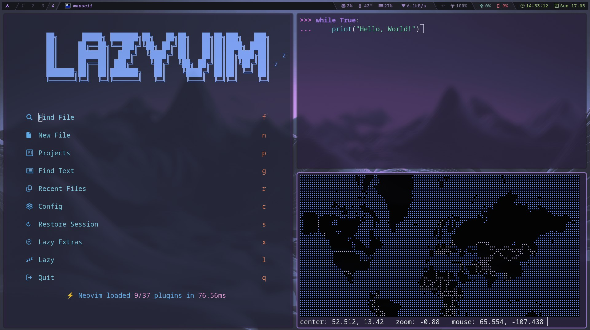
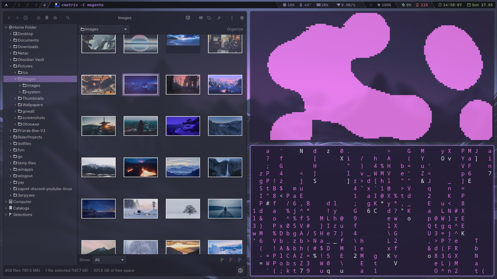
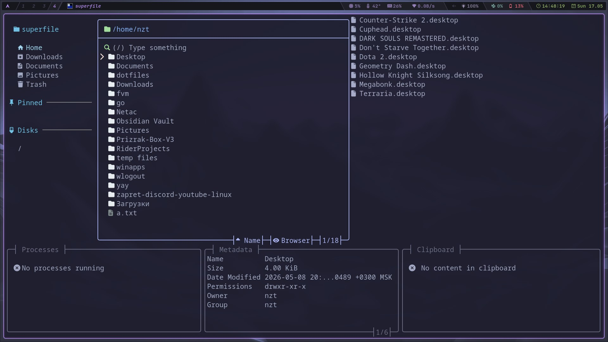
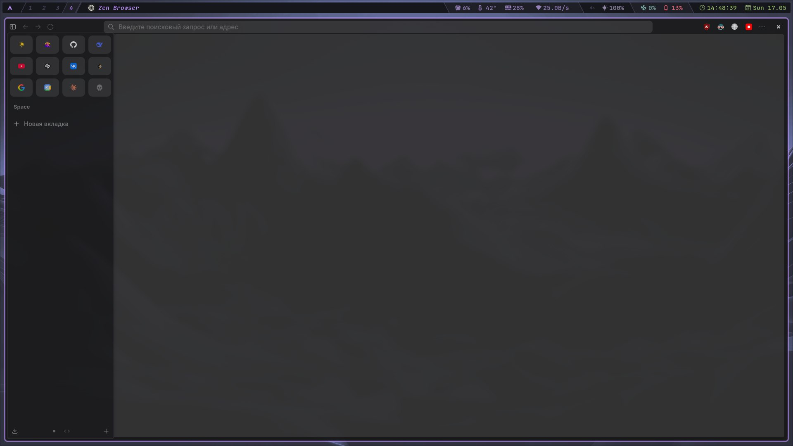

<h1 align="center"> &#128126; NZT Build &#128126; </h1>

<!-- INFORMATION -->
<h1 align="left">  &#127761; About</h1> 



</br>

 - OS: [**`Arch Linux`**](https://archlinux.org/)
 - WM: [**`Hyprland`**](https://hypr.land/)
 - Bar: [**`Waybar`**](https://waybar.org/)
 - Terminal: [**`Ghostty`**](https://ghostty.org/)
 - App Launcher: [**`Fuzzel`**](https://codeberg.org/dnkl/fuzzel)
 - Shell: [**`Zsh`**](https://github.com/ohmyzsh/ohmyzsh)
 - File manager: [**`Thunar`**](https://github.com/neilbrown/thunar)

</br>

## 🖼️ Gallery







---
 
## 🚀 Features
 
- Modular Hyprland config split across multiple files
- Custom Waybar with scripts for wifi, power, clipboard
- Fuzzel-based menus: powermenu, profile menu, wifi menu, clipboard history
- Hyprlock & Hypridle for screen locking and idle management
- OSD via SwayOSD for volume and brightness feedback
- Screenshot with Hyprshot (fullscreen & region)
- Color picker with `super + 0`
<table align="center">
  <tr>
    <th align="center">
      <sup>⚠️ WARNING ⚠️</sup>
    </th>
  </tr>
  <tr>
    <td align="center">
      THIS CONFIGURATION IS DESIGNED FOR A SINGLE MONITOR SETUP.<br>
      MONITOR CONFIG IS IN <code>Config/hypr/config/monitors.conf</code> — ADJUST TO YOUR SETUP.<br>
      IF YOU FIND ANY ISSUES, PLEASE OPEN AN ISSUE ON GITHUB.
    </td>
  </tr>
</table>
 
## 📦 Installation
 
> Manual installation via symlinks. Make sure you have all the required packages installed first.
 
**1. Install dependencies**
 
```bash
yay -S hyprland hyprlock hypridle hyprshot hyprpicker \
    waybar dunst swayosd networkmanager-applet \
    swww awww \
    ghostty thunar fuzzel \
    zen-browser telegram-desktop visual-studio-code-bin \
    wl-clipboard cliphist playerctl gawk jq bc \
    nbfc-linux power-profiles-daemon \
    brightnessctl pavucontrol-qt \
    polkit-gnome arcstarry-cursors \
    zsh oh-my-zsh-git zsh-syntax-highlighting \
    zsh-autosuggestions zsh-theme-powerlevel10k-git \
    pokemon-colorscripts-git lsd bat zoxide \
    python-gobject
```
 
**2. Clone and symlink**
 
```bash
git clone https://github.com/NZT-48-Z/Hyprland-Dotfiles.git ~/.dotfiles
cd ~/.dotfiles
 
ln -sfn ~/.dotfiles/Config/hypr       ~/.config/hypr
ln -sfn ~/.dotfiles/Config/waybar     ~/.config/waybar
ln -sfn ~/.dotfiles/Config/ghostty    ~/.config/ghostty
ln -sfn ~/.dotfiles/Config/fuzzel     ~/.config/fuzzel
ln -sfn ~/.dotfiles/Config/nvim       ~/.config/nvim
ln -sfn ~/.dotfiles/Config/dunst      ~/.config/dunst
ln -sfn ~/.dotfiles/Config/fastfetch  ~/.config/fastfetch
ln -sfn ~/.dotfiles/Config/btop       ~/.config/btop
 
ln -sfn ~/.dotfiles/Config/zshrc ~/.zshrc
```
 
---
 
## 💻 Hotkeys
 
| Key | Action |
|-----|--------|
| `Super + Enter` | Open terminal |
| `Super + Shift + E` | Open file manager |
| `Super + Shift + B` | Open browser |
| `Super + Shift + T` | Open Telegram |
| `Super + Shift + V` | Open Prizrak-Box |
| `Super + Shift + C` | Open VS Code |
| `Alt + Space` | Open app launcher |
| `Super + X` | Power menu |
| `Super + Z` | Profile menu |
| `Super + W` | WiFi menu |
| `Super + V` | Clipboard history |
| `Super + 0` | Color picker |
| `Print` | Screenshot (fullscreen) |
| `Super + Shift + Print` | Screenshot (region) |
| `Super + Shift + L` | Lock screen |
| `Super + C` | Close window |
| `Super + B` | Toggle floating |
| `Super + Space` | Fullscreen |
| `Super + H/L/J/K` | Move focus (vim keys) |
| `Super + Shift + H/L/J/K` | Move window |
| `Super + 1-9` | Switch workspace |
| `Super + Shift + 1-9` | Move window to workspace |
| `Super + LMB` | Move window (drag) |
| `Super + RMB` | Resize window (drag) |
| `Alt + .` / `Alt + ,` | Volume up / down |
| `Alt + /` | Mute toggle |
 
